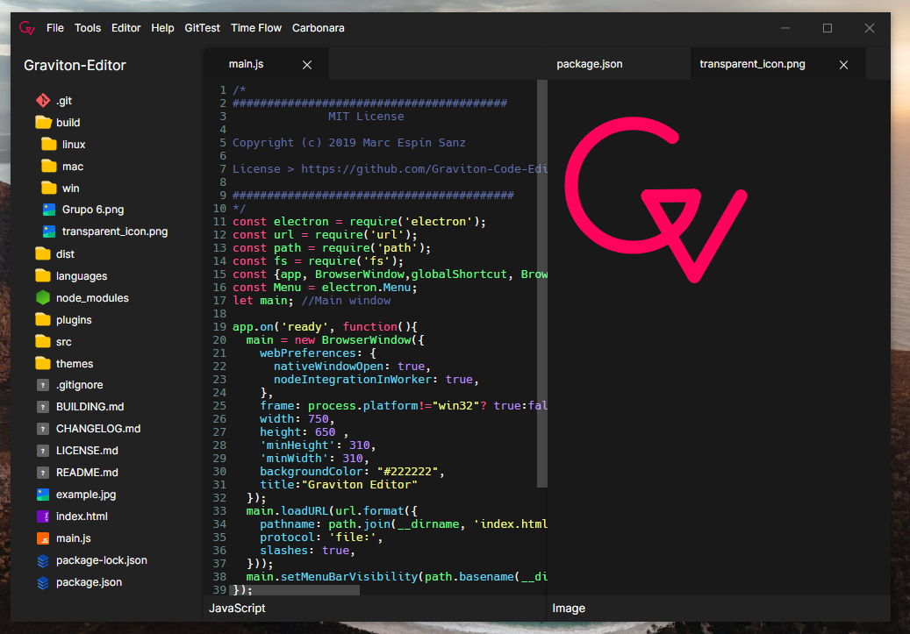

	
	 
	<a href="https://graviton.netlify.app">graviton.netlify.app</a>

Graviton is a **open source**, **cross-platform**, **minimalist-looking** code editor.

You can download it for **Windows**, **MacOS**, and **GNU/Linux** from [Graviton's Website](https://graviton.netlify.app/download), or try the **experimental** [Online Version](https://graviton.netlify.app/browser).
You can also download weekly (probably unstable) releases from the [Releases](https://github.com/Graviton-Code-Editor/Graviton-App/releases) section.

## ✨ Features

**NOTE:**
Some of these features may not be released as an official build yet, but they are already implemented in the source code.

- 🧬 Git integration
- 💻 Integrated Terminal
- ✍🏻 Intellisense (experimental) and autocompletion
- 💆‍♀️ Privacy is guaranteed (no telemetry)
- 😇 More respectful on RAM than other alternatives
- 🛢 Workspaces
- 🟢 NPM scripts integration
- 💅 Modern UI
- 🎨 Themes
- 📦 Plugins
- 🗺 Built-in image previewer
- 📝 Multi line editing

## 📣 Community

- 📢 [Telegram Channel](https://t.me/gravitoneditor)
- 💬 [Discord Server](https://discord.gg/cChzuMp)
- 💭 [Twitter](https://twitter.com/gravitoneditor)

## 🏗 Resources

- [🤓 Documentation](https://graviton.netlify.app/docs)
- [🛠 Building from source](BUILDING.md)
- [📜 Changelog](CHANGELOG.md)
- [😓 Known issues](https://github.com/orgs/Graviton-Code-Editor/projects/1#column-4042477)

## 🎁 Donating

- BTC address: 1HCBeYD564Y3AjQ3Ci6Fp2zosfZvevJuu6
- Paypal: https://www.paypal.me/mkenzo8

### Donators

- [Malok](https://github.com/malokdev)
- [Saúl Blanco](https://github.com/Saul-BT)
- Rôdeuse
- Alex Mayol
- [Machou](http://github.com/Machou)
- Cristina Piva

Thank you for the donations!

## 🖥 Available platforms

**Windows**

- `Executable (.exe, 64bits)`

**Linux**

- `Appimage (.appimage)`
- `Debian package (.deb)`
- `RPM (.rpm)`
- You can manually build from source code for more platforms if you wish.

**MacOS**

- `DMG file (.dmg)`

The current state is beta, check the releases page to download the latest version.

## 🧾 License

MIT License

Copyright (c) Marc Espín Sanz

[Full license](LICENSE.md)

## 👽 Contributors

[//]: contributor-faces

[//]: contributor-faces
