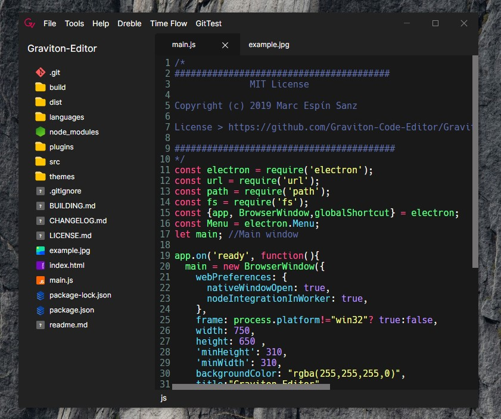

# Graviton-App

<h2>Features?</h2>

- Themes

- Plugins

- Custom highlights

- Directory tree view

- Large language support

- Time Spent Graphic 

More are comming soon

<h2>How is made?</h2>

Graviton is an Electron app, coded on HTML CSS & JavaScript, it uses nodeJS.

<h2>Can i download it?</h2>

Right now there isn't any public release, it's on alpha. It will be avaiable free and open source for Windows & Linux (and hopefully MacOS) 

